# node-voice-recorder

ReazonSpeech を使用したリアルタイム文字起こしプログラムです。

```sh
# 実行例
$ yarn start
yarn run v1.23.0-20220130.1630
$ ts-node -r tsconfig-paths/register src/index.ts
Vad | sampleRate: 48000 | hertzPerBin: 93.75 | iterationFrequency: 93.75 | iterationPeriod: 0.010666666666666666
Got SIGNAL startComplete
{"timestamp":"2023/07/23 09:07:37","action":"start"}
{"timestamp":"2023/07/23 09:07:40","action":"transcribe","filename":"0.wav","text":"テストテスト"}
{"timestamp":"2023/07/23 09:07:45","action":"transcribe","filename":"1.wav","text":"あしたの天気を教えて"}
{"timestamp":"2023/07/23 09:07:50","action":"transcribe","filename":"2.wav","text":"こんにちは"}
{"timestamp":"2023/07/23 09:07:54","action":"transcribe","filename":"3.wav","text":"おはようございます"}
{"timestamp":"2023/07/23 09:07:59","action":"transcribe","filename":"4.wav","text":"調子はどうですか"}
{"timestamp":"2023/07/23 09:08:04","action":"transcribe","filename":"5.wav","text":"お元気ですか"}
```

## システム構成



録音コマンドと音声認識サーバーの２つで構成されています。
録音コマンドはTypescriptで開発しています。実行するには [Node.js](https://nodejs.org/ja) が必要です。
音声認識サーバーは Python で作られており、認識エンジンとして[ReazonSpeech](https://research.reazon.jp/projects/ReazonSpeech/index.html)を使用しています。

## 実行方法

音声認識で使用するデータセットにアクセスするには [HuggingFace](https://huggingface.co/) のアカウントが必要です。

[HuggingFace](https://huggingface.co/) にログインして、Settings から AccessToken を選択してアクセストークンを作成します。アクセストークンの取得方法は「[User access tokens](https://huggingface.co/docs/hub/security-tokens)」を参照してください。

コピペしたアクセストークンを環境変数「HUGGINGFACE_TOKEN」に設定して docker-compose up -d を実行します。

```sh
# Hugging Face のアクセストークンを環境変数に設定
$ export HUGGINGFACE_TOKEN=XXXXXXXXXXXXXXXXX
```

音声認識サーバーは Docker を使用します。予め Docker をインストールしてください。

```sh
# compose up
$ docker-compose up -d

# コンテナにログインしてサーバーを起動
$ docker-compose exec -it reazon-dev bash
$ ./scripts/start-server.sh
```

録音側は TypeScript です。Node.js をインストールしてください。
開発時の Node.js のバージョンは v18.14.2 です。

```sh
# モジュールのダウンロード
$ npm install

# 録音開始
$ npm run start
```
